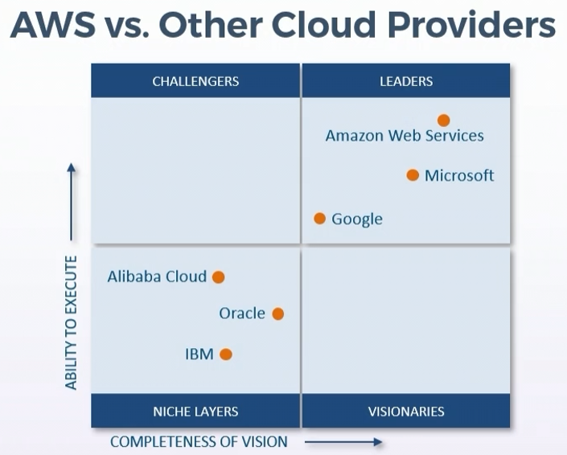

<title>@abb on AWS Cloud Practitioner, Cloud Economics</title>

Monday March 14, 2022

[ UP ](index.html)

# AWS Cloud Practitioner / Cloud Economics

## AWS client reported benefits

- 62% realize more efficient IT infrastructure staff
- 51% achieve lower 5-year cost of operations
- 90% use less staff time to deploy new storage
- 25% attain more productive development teams
- 6 months to pay back outlays

In 2017, Gartner Magic Quadrant placed AWS as Leader having both the furthest completeness of vision
and the highest ability to execute

## Other cloud providers

## Free tier model

- 12 months free for some services on new accounts
	- 750 hours per month of linux/windwos t2.micro or t3.micro depending on region
	- 5GB of standard S3 Storage
	- 750 hours per month of RDS db.t2.micro database usage
	- 25 GB of DynameDB storage
- Always free tier
- Free trials

## Pricing models

### Pay as you go

- Only pay for the specific services you need and the time you use them
- Only incur fees for the actual resources and services that your enterprise uses
- You only pay for the time that you are utilizing services
- You reduce risks of over-positioning or missing capacity
- Allows you to scale on demand within your budget
- Business are empowered to be fully elastic and flexible

### Save when you reserve

- Reserve option for services like EC2 (elastic cloud compute) and RDS (relational database service)
- You can save up to 75% when reserving capacity

### Pay less by using more

- Use managed services to help address needs
- Get volume based discount
- Gain substancial savings as usage increases
- Take advantage of S3 tier based pricing

S3 example:

- 1-50   TB 0.023 GB/month
- 51-100 TB 0.022 GB/month
- 500TB or more 0.021 GB/month

## Princing calculator

<a target="_blank" href="https://calculator.aws/#/"> Pricing Calculator </a>

Pricing calculator is the new name of the TCO (total cost of ownership) calculator

## AWS Cost Calendar

Cost Explorer is the new name for Cost Calendar

In the aws console, in the billing section there is a Cost Explorer, that gives you some predefined views

<a target="_blank" href="https://console.aws.amazon.com/billing/home?#/costexplorer">Cost Explorer</a>

- Monthly spend by service view
- Monthly spend by linked account view
- Daily spend view

