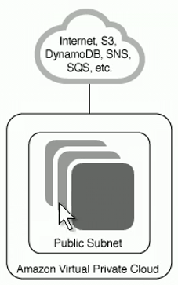

<title>@abb on AWS Cloud Practitioner, Cloud Economics</title>

Tuesday March 15, 2022

[ UP ](index.html)

# AWS Cloud Practitioner / Architecture Design Principles

- First root account and Identity Access Management - IAM
- Virtual Private Clouds - VPCs
- Amazon Machine Images - AMIs

A **Hypervisor** is the software that produces and manages virtual infrastructure
, allowing multiple operating systems to run and share resources on a sihgle physical machine

Sharing CPU cycles, RAM memory and storage.

The system running the hypervisor is called **the host**

It is commonly a rack mounted server blade.

The virtual machines running on the host are **the guest**

Each VM takes one set of physical hw

Multi-tenancy of guests usually involves OS like windows, linux, BSD, etc

## Types of Hypervisors

### Type 1 (native or bare metal)

HW | Hypervisor | Guest OS(s) | App(s)

Some implementations are:

- KVM
- Xen from Citrix
- Hyper-V from Microsoft
- vSphere/ESXi
- OVM

AWS runs on Xen type 1 hypervisors

### Type 2 hypervisor

HW | Host OS | Apps, one is a Type2 Hypervisor | Guest OS(s) | App(s)

Some implementations are:

- Oracle Virtual Box
- VMware Workstation / VMWare player / Fusion
- Microsoft Hyper-V
- Red Hat Enterprise Virtualization
- qemu

## AWS shared responsability model

AWS manages physical security and hypervisor security, it ensures guests OS
run securely isoletad from one another.

The consumer takes responsability for managing the guest operating system
(including updates and security patches), related application security, the design
of the virtual networks and logical firewall.

### Risk treatment

Reduction or Acceptance

How much do you decide to manage or use managed services?

How much is on-premises and how much is on cloud?

Shared responsability is a form of risk transference

When you migrate resources to a cloud services provider (CSP), the service level agreement (SLA)
becomes a joint shared responsability between the provider and the consumer

IasS and SaaS have clear demarcation points

PaaS demarcation is less clear, and depend on how managed service means.

## AWS provider responsability

AWS responsabilities:

- AWS datacenters are **nondescript** undisclosed locations with 24/7 staff
- MFA for facility entry with continuous monitoring, logging and auditing
- Automated changes and control processes
- Bastion services act as gateways for privileged access
- Network boundary devices monitor and audit access with intrusion detection and analysis

In **IaaS** AWS responsability lies in the gray area in the image

Customers responsabilities:

- Content stored on AWS
- AWS services used with the content
- The country where content is stored
- The format and structure
- Access to that content

The particular services determines the customer-side responsabilities.

For example with EC2 instances you would be responsible for updates and upgrades and security patching.

The **customer** is **ultimately responsible** for compliance, regulations and adhering to
attestation and auditing by third parties.

## Root account

- You should never programmatically access resources using the resource account
- If you must, keep it secure, rotate it regularly
- To delete or rotate your AWS account access keys go to
 Security Credentials page in AWS Management Console
- Setup a Multi factor authentication

Only the root account can do:

- Change the root user details and password
- Change support plan, payment options and billing
- Close the account or sign up for GovCloud
- Create an X.509v3 signing certificate
- Transfer Route 53 domain to another account

## AWS Core services

- Compute
	- EC2
	- Serverless Application Repository
	- AWS Outpost
	- EC2 Image builder
- Storage
- DB
- Networking & Content Delivery
	- CloudFront
- Identity, Security & Compliance
- Management and governance
	- CloudWatch
	- CloudFormation
	- CloudTrail
- VPC

## VPC (virtual private cloud)

On VPC Dashboard

There are several network resources

There is a default VPC, it uses a 16bit mask, you can have several subnets

You can have many VPCs on your account, Custom VPC is labeled as **Non-default VPC**

Example: having 3 subnets in your VPC, you can put each one in an
availability zone having high availability.

VPC wizard is infrastructure as code: You can use CloudFormation

Ways to configure a VPC:

1. VPC with a single public subnet
 

2. VPC with public and private subnets
 

3. VPC with public and private subnets and hardware VPN access
 

4. VPC with a private subnet only and hardware VPN access
 

### Networking details

AWS creates a default VPC

For each VPC it creates 3 subnets

You can view the route table for each subnet

If a subnet has configured a **IGW** (Internet Gateway) it is considered public

If I remove the IGW it becomes a private subnet

I can add a **VPG** (Virtual Private Gateway) to connect to a VPN

An Instance can be asigned a public IP address from the IP pool or an Elastic IP address

An Elastic IP address is also taken from the pool, but the beauty is asigned to your account, and
you can reallocate to other EC2 instance. If you have a Elastic IP and is not assigned, you will
be charged.

To being able to communicate a instance that is only on private subnet, you have to add a NAT
gateway, the NAT gateway sits in the public subnet.

By the way, a NAT gw has to use an Elastic IP address. NAT is used *only for IPv4*.
 For IPv6 you need to use an **Egress Only Internet Gateway** *only for IPv6*.

DHCP options can be used if you want to modify the default DHCP server.

#### Network Endpoints

Endpoints allows you to setup communication between services in the AWS cloud, there are 2 types:

- Gateway endpoint: It is configured in the subnet route table. For example connect your instances
to a DB or S3 service.

- Interface endpoint: Does not involve anything in the route table. For example if I want to not use
a volume to store my files, and use Elastic File System (cool service that allows to shrink
and grow storage), you have to configure an **Endpoint** and it is going to be a logical network
interface, and use one IP address.

The Interface endpoint will use one of the IP adress in your subnet, while the gateway endpoint
is just an entry in the route table.

If you want to connect two VPCs you will do that through **Peering Connections** it can be done
even between different root accounts, one is the requester and the other is the accepter.
 The IP address can not overlap
 They are not transitive, that means you have to explicitly create a peer for each pair of VPCs

## AMI :: Amazon Machine Image

**EC2** - Elastic Cloud Compute

EC2 instance is a provisioned virtual machine, to provision a virtual machine you start from
a software stack image or AMI.

There is a AMI marketplace with more than 500 images of different OSs and software stacks.

You can build your own AMI with the **EC2 Image Builder**, also it can build docker Images.

AMI is a software template which includes OS and optionaly applications.

There is a lot of Linux distributions for everyone like:

- Amazon linux
- Cent OS
- Debian
- Fedora
- Gentoo
- openSUSE
- Red Hat
- SUSE
- Ubuntu
- Windows
- MacOS

For several architectures:

- 32-bits x86
- 64-bits x86
- 64-bits Arm

The AMI will include the root volume of that particular OS

In IaaS you will be responsible of licence and software tthat is installed within the Instance

## Storage

- **EBS** :: Elastic Block Storage
- Instance Store

Will be covered later.

## Secure connectivity options

There are several options to connect to the resources in a VPC that is not public:

- **Virtual private gateway** (VPG) for this option, first you create a Customer Gateway,
that is the device at your headquarters (physical or virtual) that you will use to connect.
That device has to know routes to resources in your VPC subnets.
 There is Static or Dynamic routing protocol options, with Dynamic you have to assign
the BGP (border gateway protocol) ASN (autonomous system number). 64512-65534 (are for
private use)
 You have to configure the public IP address or have a Certificate (Certificate ARN).
 You could go to *Certificate Services* in AWS and generate an X.509v3 cert for that
device and simple choose it.
  Having the Custom Gateway created, you create the VPG, an this will go to the route table
in the VPC.

- **Site-to-Site VPN Connections** after you have created the Customer Gateway and the VPG, you
go to this menu, and configure both.
 This will create 2 tunnels for us so we have a failover.
 AWS can assign the IPv4 address (from APIPA 169.254.*.*)
 Even can create a pre-shared key
 Many params of IPSec can be configured
 AKA in the past as <u>Managed VPN</u>

- **Client VPN Endpoint**, this is a client to site VPN, you install open VPN in the client
(your mobile, laptop, workstation).
 AKA in the past as <u>Peer to site VPN</u>

