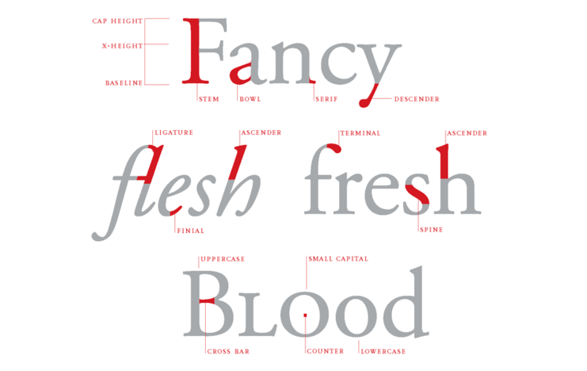

# Typography

## Font families

Sans serif typefaces
	- Baskerville (1757)
	- Futura (1927)
	- Nobel (1929)
	- Gill Sans
	- News Gothic
	- Trade Gothic (1948)
	- Franklin Gothic
	- Univers (1957)
	- Helvetica (1957)
	- Univers (1957)
	- Gotham
	- Garamond (1989)
	- Meta (1991)
	- Didot (1992)
	- Thesis Serif (1994)
	- Mrs Eaves (1996)
	- Verdana (1996)

###Project:

You can create a Business Card using only letters and typography

## Lingo

<b>Tracking</b>, refers to spacing between letters, is good for Uppercase, it makes stand out its square nature, looks terrible for lowercase.

<b>Kerning</b> adjusts the space between a pair of letters, making an even effect.

<b>Metric kerning</b> is the space built into the typeface, the designed put it there.

<b>Optical kerning</b> is automatically executed by the page layout software, works better with headlines with large-scale type.

<b>Small Caps</b> integrate peacefully with lowercase letters.

<b>Pseudo small caps</b> are an averration againts nature, tryin to provide small caps to fonts that does not have it.

<b>Drop capital</b> or drop cap is an enlarged letter, a traditional feature of book design.

<b>Slabs</b> is a font familiy for fonts created merging two font styles as one, Adelle is an example of this font.

## Software related

- Adobe InDesign

## References

- [ Typography That Works: Typographic Composition and Fonts ](https://skl.sh/3s3TUmE)

